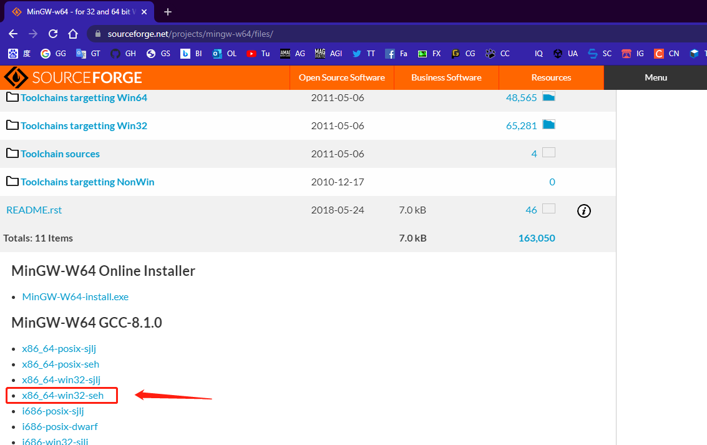

# vsTest_OpenGL

## 十一，开发日志 2022/03/04
### 1，主要特性
>* 增加了对作为 fork 外部 Diff 工具的支持
>>* 打开 fork -> file -> preference -> integration 找到 External Diff Tool 选项
>>* Diff Tool 设置为 Custom
>>* Diff Tool Path 设置为 mdv.exe 所在的路径
>>* Arguments 设置为 $LOCAL (本地) $REMOTE (远端)
>>* 配置完成后，查看 fork 提交记录时，右键点击本地文件，选择 External Diff 即可启动

---

## 十，开发日志 2022/02/23
### 1， 主要特性
>* 修复了模型加载后，部分网格因为没有继承局部变换而位置错误的问题
>* .fbx 文件可以在任何位置打开
>* 目前会按照硬编码的形式寻找网格贴图，贴图要与 .fbx 文件同目录，名称与网格名称相同，例如 网格名称位 Suit_33，它的贴图规则就是 Suit_33_D.png，扩展名可以位 .jpg, .png, .tga 也可以
### 2，待解决
>* 导入骨骼变换与动画
>* 文字显示
>* 编译环境库到执行文件中
>* 自动适配摄影机参数观察模型

---

## 九，开发日志 2022/02/11

### 1, 主要特性
>* 贴图可以正常加载
>* 重构了材质球逻辑
>* FBX 模型导入时不需要在垂直方向上反转 UV
>* 渲染管线除了渲染 Model， 还可以单独渲染基于数据的 Mesh
>* 数字 1 键，模型在网格与贴图两种模式间切换
>* 数字 2 键，用一个 Plane 查看当前已经加载的材质

### 2, 待解决
>* 一些 subMesh 导入后，位置不对，如图 （ 手套落到了地上 ）
>* 文件可以从任何路径打开
>* UI 文字说明支持
>* 光照模型支持
>* 带动画播放功能
>* GIT COMMAND 抓取历史网格数据
>* 分屏显示

---

## 八，开发日志 2022/01/25
### 1, 主要特性
>* 更新了鼠标操作逻辑, 左键安装控制视角，右键按住控制高度，中键复位, 滚轮控制远近
>* 开启 vsync
>* 加入 deltatime

---

## 七，开发日志 2022/01/21

### 1, 主要特性
>* assimp 移除了除 fbx 导入之外的其他功能，将执行程序大大小控制到 30+ MB, 完整功能在静态编译的情况下要 130MB + 严重影响打开程序体验
>* 可以正常加载模型，绘制模型前需要调整坐标轴
>* 交互操控添加了 W 和 S 键，用于控制摄影机升降
>* 模型资源默认放在 resource/models 文件夹下

### 2, 待解决项
>* 验证摄影机控制的便捷性
>* 为了控制执行程序的大小, 需要调研 fbx sdk 是否更合理
>* 模型目前没有加载材质 ID, 需要补充该功能

---

## 六，开发日志 2022/01/14
### 1, 完成基于 CMake 的项目重构，现在直接打开工程目录的下 mdv 文件夹内的 .exe 执行程序即可看到结果
>* 将所有第三方库改为通过 submodule 导入，不再需要预编译操作
>* 所有源文件会通过 CMakeLists.txt 文件构建
>* 解决找不到 shader 文件时程序会崩溃的问题
>* 现在所有资源文件 shader, texture, mesh 都位于 resources 文件夹下

### 2, 待解决
>* gcc 运行库目前是直接拷贝到目录的方式，不明确是不是最优解
>* 发现程序没有做视口变换的适配，需要解决

---

## 五，开发日志 2022/01/04
### 1，完成使用球面坐标系构建摄影机空间位置，新增 interactive 类作为鼠标交互逻辑

### 2，完成观察摄影机添加惯性旋转的功能

---

## 四，开发日志 2021/12/15
### 1，环境配置说明，如果是切到最新提交记录，请按照如下步骤配置环境
>* 在 [https://sourceforge.net/projects/mingw-w64/files/] 下载自己系统对应的版本(往列表下面看)，我是 [win10_X64] 下载的是 *x86_64_win32-seh* (47.8 MB)，下载后解压
>* 在 windows 系统环境变量中，添加 Path 项，指定到 mingw-w64 的 .../bin 位置 ，/bin 目录中还有一个 *mingw32-make.exe* 文件，复制它，重命名为 *make.exe*，后面会用到 MakeFile 中
>* 生成 glad 静态库文件，在这个链接 [https://glad.dav1d.de/] 下生成 *glad.zip* 文件，Language(c/c++)，Specification(OpenGL)，API(最高版本)，Profile(Core) 需要设置，勾选 *Generate a loader* 生成，生成后下载 glad.zip 文件解压
>* **gcc ./src/glad.c -c -I ./include/** //在终端执行这个命令，会在当前目录下生成 *glad.o* 文件
>* **ar -rc libglad.a glad.o** //在终端执行这个命令，会在当前目录下生成 *libglad.a* 文件，将这个文件也放入工程目录的 \lib 文件夹下
>* 将 glad 解压包中的 \include 文件夹下的内容，也全都放到工程目录的 \include 文件夹下
>* 打开 vs code 的 Terminal， 输入 make run 测试程序
### 2，开发状态
>* 重构 geometry 与 cam 的构造函数，二者均继承 object 类
>* object 类提供默认的 transform 成员

---

## 三，开发日志 2021/12/10
### 1，已完成
>* camera 类，摄影机参数，摄影机矩阵等
>* transform 类，Debug，空间变换等
>* texture 类，纹理文件的读取，纹理模式，mipmap 等
>* geometry 当前坐标均为模型空间下
>* vertex shader 需要包含 mvp 矩阵才能正常渲染
### 2，下版本目标
>* 窗体交互
>* 模型加载

---

## 二，开发日志 2021/11/26
### 1，完成代码重构，主要代码文件说明
>* 源文件都在 ./src 目录下，头文件都在 ./include/users 目录下，shader 文件都在 ./src/shaders 目录下
>* geometry 类，几何体计算，预设几何体数据
>* mrp 类，渲染管线类，包括绘制，剔除，清除，设置渲染数据
>* shader 类，读取 shader 文件，编译，链接，调用 
>* main.cpp，主程序入口
>* make run，终端运行命令
### 2，当前开发状态
>* 完成默认 VBO 渲染
>* 完成 shader 类
>* 完成 mrp 类
>* 完成 geometry 类
### 3，待开发
>* 摄影机参数
>* 几何体模型加载
>* 第一版光照模型
>* 窗体交互逻辑

---

## 一，配置开发环境
1，配置 vscode 的 c++ 开发环境，首先需要配置 gcc 和 g++ 的编译器，可以在 [https://sourceforge.net/projects/mingw-w64/files/] 下载自己系统对应的版本(往列表下面看)，我是 [win10_X64] 下载的是 *x86_64_win32-seh* (47.8 MB)。

___

2，下载完成后解到固定目录，注意文件夹中有一个 /bin 目录，将这个 /bin 目录的完整路径添加到系统变量的 Path 中，打开 [git bash] 或者 [window powershell]，输入 **gcc --version**，**g++ --version** 和 **gdb --version** 命令，如果配置成功会显示编译器信息，注意 /bin 目录中还有一个 *mingw32-make.exe* 文件，复制它，重命名为 *make.exe*，后面会用到

___

3，为 vscode 安装必要插件 [C/C++ By Microsoft]， [C/C++ Project Generator By danielpinto8zz6]，[Code Runner By Jun Han]，到这一步可以实验一段 c++ 代码看看是否能运行。使用 Ctrl + Shift + P 呼出 vscode 命令行，选择 Create Project ，选择自己的工程目录文件夹，插件会自动创建所需的 \lib, \include, 等文件夹，可以使用 make run 运行程序，如果运行失败，要检查 /.vscode 文件夹中 *c_cpp_properties.json* 的配置，如果运行成功则可以进行下一步

___

4，下载 glfw 框架，[https://www.glfw.org/download.html]，要下载与自己的 minGW 对应的版本，我这里是 *64-bit Windows binaries* 的预编译文件

___

5，配置库文件
>* glfw 解压包中的 \include\GLFW 文件夹，放入工程目录中的 \include 文件夹下
>* glfw 解压包中的 \lib-mingw-w64 文件夹下的 *libglfw3.a* 和 *libglfw3dll.a* 两个文件，放入工程目录的 \lib 文件夹下，*glfw3.dll* 文件放到工程目录的 \output 文件夹下
>* 生成 glad 静态库文件，在这个链接 [https://glad.dav1d.de/] 下生成 *glad.zip* 文件，Language(c/c++)，Specification(OpenGL)，API(最高版本)，Profile(Core) 需要设置，勾选 *Generate a loader* 生成，生成后下载 glad.zip 文件解压
>* **gcc ./src/glad.c -c -I ./include/** //在终端执行这个命令，会在当前目录下生成 *glad.o* 文件
>* **ar -rc libglad.a glad.o** //在终端执行这个命令，会在当前目录下生成 *libglad.a* 文件，将这个文件也放入工程目录的 \lib 文件夹下
>* 将 glad 解压包中的 \include 文件夹下的内容，也全都放到工程目录的 \include 文件夹下

___

6，测试库文件，可以在测试的 cpp 代码中包含 **#include <glad/glad.h>** 和 **#include<GLFW/glfw3.h>** ，如果不报错，则是包含成功，这时 **make run** 命令也应该是正常的，否则要检查 *c_cpp_properties.json* 文件

___

7，配置 Makefile 命令，打开 Makefile 文件
>* 在 # define lib directory 注释下添加变量，**LIBRARIES := -lglad -lglfw3dll**
>* 在 75 行  \$(OBJECTS) \$(LFLAGS) \$(LIBS) 代码后面再加入 \$(LIBRARIES)，之后再运行 make run，正常

___

8，最终测试代码，**make run** 运行，显示一个小窗口

___

### 测试代码
~~~
#include <glad/glad.h>
#include <GLFW/glfw3.h>

#include <iostream>

void framebuffer_size_callback(GLFWwindow* window, int width, int height);
void processInput(GLFWwindow* window);

const unsigned int SCR_WIDTH = 300;
const unsigned int SCR_HEIGHT = 200;

int main()
{
	glfwInit();
	glfwWindowHint(GLFW_CONTEXT_VERSION_MAJOR, 3);
	glfwWindowHint(GLFW_CONTEXT_VERSION_MINOR, 3);
	glfwWindowHint(GLFW_OPENGL_PROFILE, GLFW_OPENGL_CORE_PROFILE);

	GLFWwindow* window = glfwCreateWindow(SCR_WIDTH, SCR_HEIGHT, "OpenGL and Miles", NULL, NULL);
	if (window == NULL)
	{
		std::cout << "Failed to create GLFW window" << std::endl;
		glfwTerminate();
		return -1;
	}
	glfwMakeContextCurrent(window);
	glfwSetFramebufferSizeCallback(window, framebuffer_size_callback);

	if (!gladLoadGLLoader((GLADloadproc)glfwGetProcAddress))
	{
		std::cout << "Failed to initialize GLAD" << std::endl;
		return -1;
	}

	while (!glfwWindowShouldClose(window))
	{
		glClearColor(0.3, 0.5, 0.8, 1);
		glClear(GL_COLOR_BUFFER_BIT);
		processInput(window);
		glfwSwapBuffers(window);
		glfwPollEvents();
	}

	glfwTerminate();
	return 0;
}

void processInput(GLFWwindow* window)
{
	if (glfwGetKey(window, GLFW_KEY_ESCAPE) == GLFW_PRESS)
		glfwSetWindowShouldClose(window, true);
}

void framebuffer_size_callback(GLFWwindow* window, int width, int height)
{
	glViewport(0, 0, width, height);
}
~~~

___
